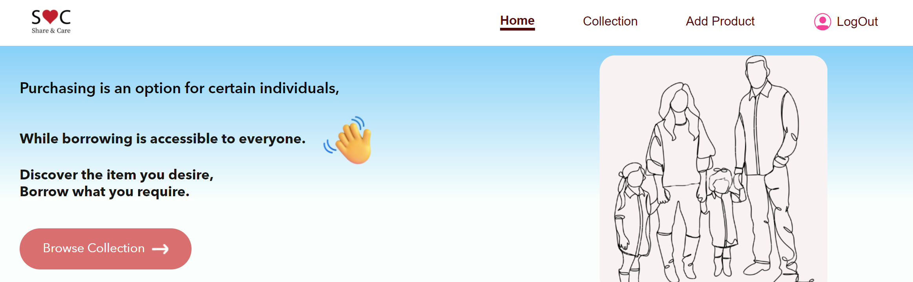
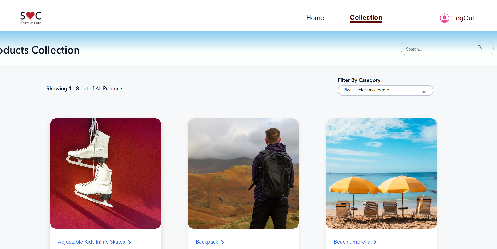
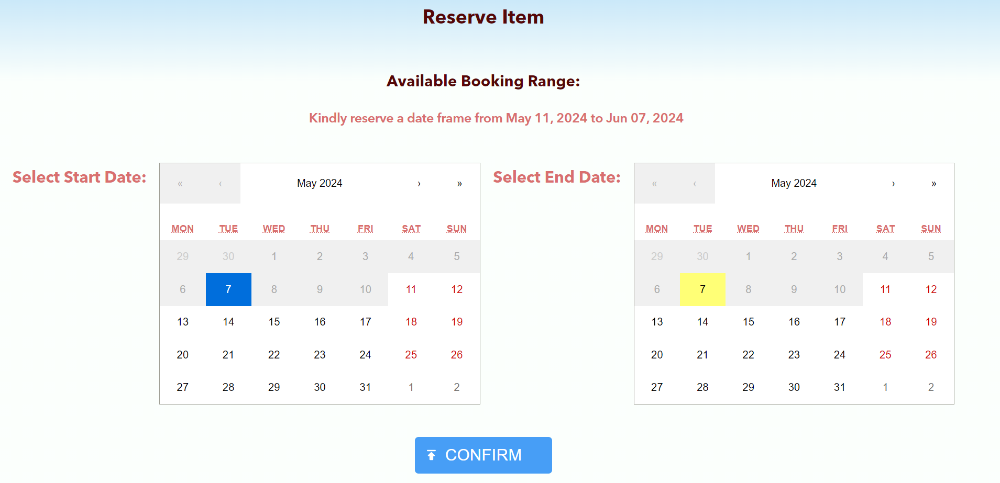

# Getting Started with Create React App

This project was bootstrapped with [Create React App](https://github.com/facebook/create-react-app).

## Available Scripts
Install dependencies on the projects client directory: npm install

Create the .env by using .env.example as a reference: cp .env.example .env Update the .env file with correct information
PLEASE GENERATE SECRET_KEY
Open your terminal or command prompt.
Run the following Node.js script to generate a random string:
node -e "console.log(require('crypto').randomBytes(32).toString('hex'))"
You can run the client:
### `npm start`

Runs the app in the development mode.\
Open [http://localhost:3000](http://localhost:3000) to view it in your browser.

# Project Title

Share 'n' Care Depot

## Overview

What is your app? Brief description in a couple of sentences.
Introducing "Share 'n' Care Depot," an app designed for neighbors to donate or borrow various items for free. Whether it's a camping tent for a week or furniture for permanent use, users can select from a diverse range of offerings based on availability.
There is a physical space and an online catalogue of things that people can borrow locally / have forever.

### Problem

Why is your app needed? Background information around any pain points or other reasons.
This platform facilitates quick access to rarely used product, as well as useful furnitures, kitchen appliances, allowing users to easily connect with us while reducing unnecessary waste.I want to make reusable furniture disposal accessible and pleasant.
Environmental Consciousness: Many people want to contribute to sustainability efforts but struggle to find convenient ways to dispose of reusable furniture responsibly. the app provides a solution by offering a seamless process for donating furniture, thereby reducing waste and promoting environmental conservation.

### User Profile

Who will use your app? How will they use it? Any special considerations that your app must take into account.
"Share 'n' Care Depot" fosters a community spirit of sharing and caring while providing a convenient platform for resource utilization and conservation. Neighbors with limited budget or students, newcomers/ tenant who recently moved from another city to a certain neighborhood, or who r unable to take their belongings with them during their next move to another province/ country.

### Features

List the functionality that your app will include. These can be written as user stories or descriptions with related details. Do not describe _how_ these features are implemented, only _what_ needs to be implemented.

Key features include:

All existing product shows up on the Collection page with pagination for easy browsing.
User Can search items and filter by category enabling them to find specific items quickly.

User will reserve items through the booking calendar and after that confirmation email will be sent in their registered email. 
In the Calendar reserved dates will be disabled for that item and other dates will be enabled.

Registered users can borrow product and return the item on time to ensure fair access for all.The length of borrowing time is flexible, and if you still need the item after the due date, just let us know by email or phone. Renewals are always accommodated as long as no one else has requested or reserved the item.

That’s it! When you’re done with the item or when the due date arrives, simply drop it off for the next borrower to use. Items can be returned directly to our location, everyday evening.

Communication via email to coordinate item pickup/drop off with the borrower and donor.

## Implementation

### Tech Stack

List technologies that will be used in your app, including any libraries to save time or provide more functionality. Be sure to research any potential limitations.

REACT, Node.js + Express, JS, MySQL, nodemailer, firebase, JWT, react-calendar, regex validation

### APIs

List any external sources of data that will be used in your app.
Own API

### Sitemap

List the pages of your app with brief descriptions. You can show this visually, or write it out.

### Browse the inventory, Registered user would be able to reserve available items to borrow, after reserving they will receive confirmation email to come and pick up at a specific time/day.

### Borrow item from the location, reserve items in booking calendar, search and filter products

### Admin Add new Product with images and item details, uploaded image is stored in firebase

### How to Start with Home Page where brief description of how to use the facility
### It is mainly a desktop only app with a few features for users

### Login Logout using JWT authentication

## Nice-to-haves

### Volunteer

Volunteers are what continue to make the Depot a success! Join our team and help us build a more resilient community.
###    Donate things, arrange pickup for heavy items, if any or drop off at convenient time

### Donate Funds with stripe

### Users and admin profile

deploying app with cloud storage?,
user should be able to like and make comments on the items?
Would like to volunteer with us? volunteers page
FAQs, Guidelines for donation: Option for users/donors to donate funds for facility maintenance using their cards.
Direct messaging capability for expressing interest in items.

